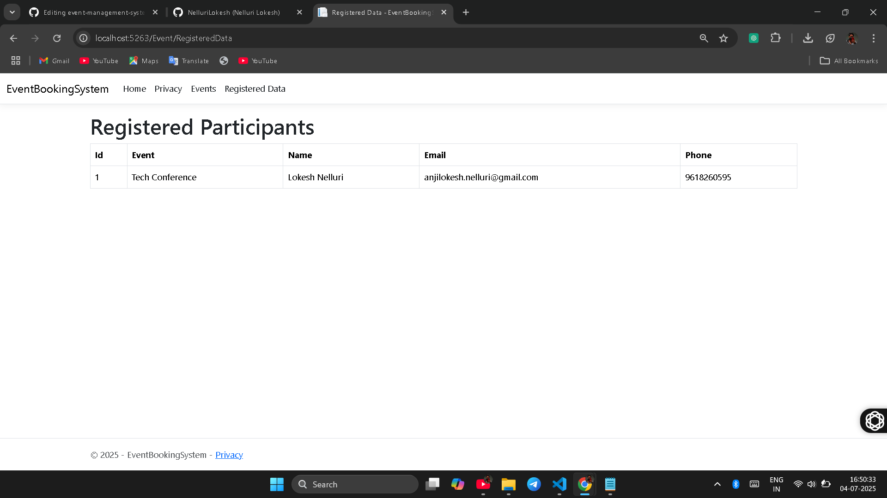

Event Management Web Application (with Passcode Protected Event Creation)
===========================================================================

This is an extended version of the Event Management web application built using **ASP.NET Core MVC**. 
In this version, event creation is protected with a passcode system.

Features
--------
✅ View list of upcoming events
✅ Register for an event (with form validation)
✅ Passcode-protected event creation (only users with valid passcode can create events)
✅ View list of all registered participants
✅ Thank you page after successful registration

Project Structure
-----------------
EventManagement/
├── Controllers/
│   └── EventController.cs
├── Models/
│   ├── Event.cs
│   ├── Registration.cs
│   └── Passcode.cs
├── Views/
│   ├── Event/
│   │   ├── Index.cshtml
│   │   ├── Register.cshtml
│   │   ├── Create.cshtml
│   │   ├── Passcode.cshtml
│   │   ├── RegisteredData.cshtml
│   │   ├── ThankYou.cshtml
│   │   └── Notfountt.cshtml
├── wwwroot/
│   └── css, js, images (static files)
├── Program.cs
├── Startup.cs
└── EventManagement.csproj

How to Run
----------
1. Clone the repository:

   git clone https://github.com/yourusername/EventManagement.git

2. Navigate to the project folder:

   cd EventManagement

3. Restore dependencies and build the project:

   dotnet restore
   dotnet build

4. Run the application:

   dotnet run

5. Open in browser:

   https://localhost:5001 (or the port shown in your console).

Passcode for Event Creation
---------------------------
To create a new event, you need to enter a valid passcode.  
Sample passcodes included in the application:
- 1234
- 12345

If an invalid passcode is entered, you will be redirected to a "Not Found" page.

Example Events
--------------
The application starts with two pre-defined events:
- Tech Conference (in 10 days)
- Music Fest (in 20 days)

Screenshots
-----------
You can add images here by uploading them to your repo (e.g., in a folder named "images") and then using markdown syntax:

Technologies Used
-----------------
- ASP.NET Core MVC
- C#
- Razor Views
- Bootstrap (optional, for styling)

Contributing
------------
Feel free to fork this repository and submit pull requests. Contributions and suggestions are welcome!

License
-------
This project is open-source and available under the MIT License.

Author
------
- [Nelluri Lokesh](https://github.com/NelluriLokesh)

⭐ If you like this project, please give it a star!
